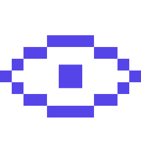

SDK oficial · TypeScript · Node.js 18+

# Eyedux SDK para TypeScript

Integre eventos de aplicações TypeScript e JavaScript ao Eyedux com uma API pequena, tipada e independente de framework.

[Começar a integrar](client-integration.md){ .md-button .md-button--primary }
[Ver a referência da API](api-reference.md){ .md-button }

## Encontre o caminho certo

- :material-rocket-launch-outline: **Integração em minutos**

    Configure a API key, defina o projeto e envie o primeiro evento.

    [Abrir o guia](client-integration.md)

- :material-api: **Contrato do SDK**

    Consulte construtores, métodos, tipos, erros, cancelamento e timeout.

    [Consultar a referência](api-reference.md)

- :material-shield-check-outline: **Pronto para backend**

    Mantenha segredos no servidor, trate falhas explicitamente e controle as tentativas de retry.

